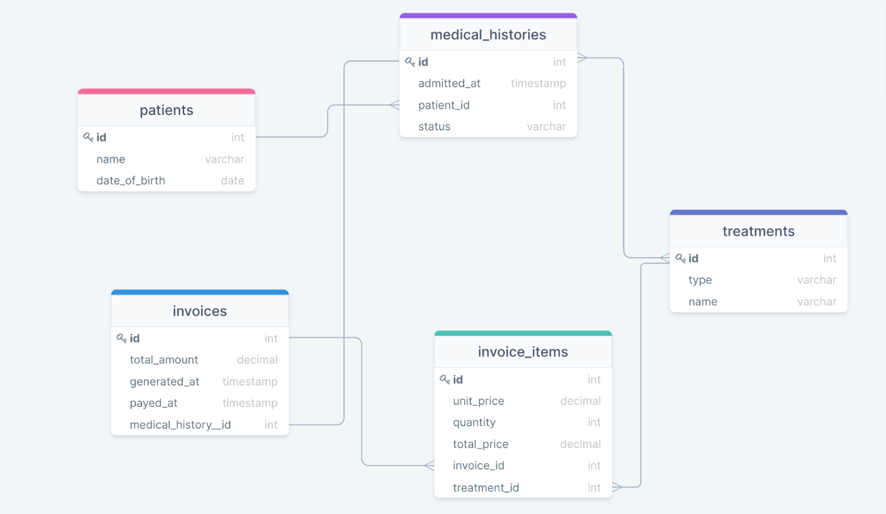

# medical-clinic-database

<a name="readme-top"></a>

<div align="center">

  
  <br/>
   
</div>
<!-- TABLE OF CONTENTS -->

# 📗 Table of Contents

- [📖 About the Project](#about-project)
  - [🛠 Built With](#built-with)
    - [Tech Stack](#tech-stack)
    - [Key Features](#key-features)
- [💻 Getting Started](#getting-started)
  - [Setup](#setup)
  - [Prerequisites](#prerequisites)
  - [Install](#install)
- [👥 Authors](#authors)
- [🔭 Future Features](#future-features)
- [🤝 Contributing](#contributing)
- [⭐️ Show your support](#support)
- [🙏 Acknowledgements](#acknowledgements)
- [📝 License](#license)

<!-- PROJECT DESCRIPTION -->

# 📖 medical-clinic-database <a name="about-project"></a>

The **medical-clinic-database** is a relational database management system (RDBMS) that focuses on managing data related to animals and users. By following the provided instructions, users can recreate the database by executing the `schema.sql` files.

The `schema.sql` file contains the necessary SQL statements to create the tables and define the relationships for managing animal data, user data, and possibly other relevant information. This includes table structures, data types, primary keys, foreign keys, and constraints.

Once the database is set up with the tables and populated with the sample data, users can explore and interact with the information using the provided sample queries in the queries.sql file. These queries demonstrate how to retrieve, filter, update, and analyze data from the database, providing a starting point for further query development.

Overall, the **medical-clinic-database** project offers a comprehensive solution for managing animal and user data in an RDBMS. It provides a pre-defined schema, sample data, and example queries, enabling users to recreate the database, populate it with relevant information, and perform various operations on the data.

## 🛠 Built With <a name="built-with"></a>

### Tech Stack <a name="tech-stack"></a>

<details>
  <summary>Client</summary>
  <ul>
    <li>SQL</li>
  </ul>
</details>

<details>
  <summary>Server</summary>
  <ul>
    <li>Used local server</li>
  </ul>
</details>

<details>
<summary>Database</summary>
  <ul>
    <li><a href="https://www.postgresql.org/">PostgreSQL</a></li>
  </ul>
</details>

<!-- Features -->

### Key Features <a name="key-features"></a>

- **It provides a pre-defined schema**
- **sample data, and example queries**
- **enabling users to recreate the database**
- **populate it with relevant information and**
- **perform various operations on the data**
- **vet_clinic database**
- **animals table**

<p align="right">(<a href="#readme-top">back to top</a>)</p>

<!-- GETTING STARTED -->

## 💻 Getting Started <a name="getting-started"></a>

To get a local copy up and running, follow these steps.

## Prerequisites <a name="prerequisites"></a>

- In order to run this project you need:

### It would be best if you had some familiarity with `SQL` and `POSTGRESQL`.

- A Computer (MAC or PC)
- code editor (VSCode,Atom etc...)
- A browser (Chrome,Mozilla,Safari etc...)
- Version Control System (Git and Github)

### Setup

Clone this repository to your desired folder:

```bash
       git clone https://github.com/AbdusSattar-70/medical-clinic-database.git
```

### Install

Install this project with:

```sh
  cd medical-clinic-database
```

<!-- AUTHORS -->

## 👥 Authors <a name="authors"></a>

## 👤 Abdus Sattar

- GitHub: [AbdusSattar-70](https://github.com/AbdusSattar-70)
- Twitter: [Abdus Sattar](https://twitter.com/Abdus_Sattar70)
- LinkedIn: [Abdus Sattar](https://www.linkedin.com/in/abdus-sattar70/)

👤 **Lovi Madaan**

- GitHub: [LoviMadaan](https://github.com/LoviMadaan)
- Twitter: [@lovinarang](https://twitter.com/lovinarang)
- LinkedIn: [LoviMadaan](https://www.linkedin.com/in/lovi-madaan-b27439175)

<p align="right">(<a href="#readme-top">back to top</a>)</p>

<!-- FUTURE FEATURES -->

## 🔭 Future Features <a name="future-features"></a>

- add more data into the table
- add more operation like delete, update

<p align="right">(<a href="#readme-top">back to top</a>)</p>

## 🤝 Contributing <a name="contributing"></a>

Everybody is welcome to suggest, changes,Contributions, issues, and feature request in this project.

In order to do it, fork this repository, create a new branch and open a Pull Request from your branch.

Feel free to check the [issues page](../../issues/).

<p align="right">(<a href="#readme-top">back to top</a>)</p>

<!-- SUPPORT -->

## ⭐️ Show your support <a name="support"></a>

If you like this project, Please give me ⭐️ and you can use it following [MIT](./LICENSE) license.

<p align="right">(<a href="#readme-top">back to top</a>)</p>

<!-- ACKNOWLEDGEMENTS -->

## 🙏 Acknowledgments <a name="acknowledgements"></a>

- I would like to thank and appreciate who contributes this project. And I would like to thank my coding partner [Lovi Madaan](https://github.com/LoviMadaan) for her contribution to the project.

<p align="right">(<a href="#readme-top">back to top</a>)</p>

<!-- LICENSE -->

## 📝 License <a name="license"></a>

This project is [MIT](./LICENSE) licensed.

<p align="right">(<a href="#readme-top">back to top</a>)</p>
